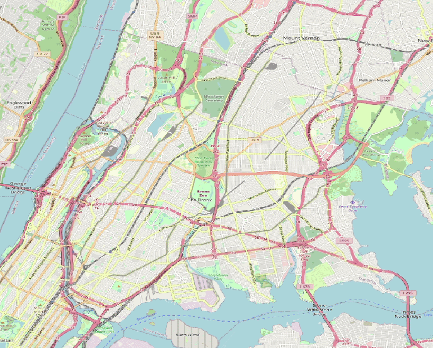

# ny-ride-share-analysis
An analysis of ride share information based on the FOI request to TLC in regards to ride share data concerning taxis, uber and competitors

<!-- GETTING STARTED -->
## Purpose

The data provided by TLC in response to a FoI request from a Mr. Bialik, provides an excellent view into the movements of Taxi and Rideshares in NY city in 2016.

## Steps

1. Seek business scope and client use cases
    No scope limitations were available, the exercise is left completly open
2. Work through the data
    * Visualise geo data
    * Plot other data points
    * Prune/Wrangle Data
3. Identify any data catagories of note and spot check for trends
4. Gather analysis
5. Visualise analysis
6. Produce report

## Diary

1. Setup Workspace
2. Download data
3. Read through TLC and go through csvs in excel
4. csvs are somewhat clunky or weird row usage, minor edits to make it easier to traverse.
5. Import Jul14 Uber raw data into QGIS to visualise,
6. Visualise by base, notice immediantly the sheer ammount of overlap, bases almost seem like a null indicator
    * IDEA: Looks like theres alot of pickups around the airport almost as much as in
    * IDEA: How does the base value work for ubers compared to taxis, possible to compare pickup vs base?
7. Graphed all FHV data and noticed that there are cycle, also that 1st of september is taxis worst day then skyrockets from there?
8. Something happened on the 1st of september 2014, googling showed there was uber protests about fare price being cut in july 2014 and a limit of surge pricing https://money.com/uber-price-cut-fare-new-york-city/ https://www.mercurynews.com/2014/07/07/uber-temporarily-cuts-prices-on-taxi-like-service-in-new-york-city/

"Uber will keep 20 percent commission for each ride, and drivers will make less per trip, though they should see more riders in a day, Mohrer said. In all other cities where Uber has initiated price cuts for UberX, trips per hour have increased, he said."

https://data.cityofnewyork.us/ to get borough

9. Pivot to looking at QGIS again, Download NYC and NJ borough GIS polygon
10. Isolate Bronx as a representaive suburb to test on.
11. Clustering points using DBScan to cluster close points and heatmap to visualise shows points of heavy use for the whole month
12. Visualise Clusters over time to inform congestition information, aggregate over weekly intervals as informed from cyclic nature of FHV exploration
13. Write down explanation of findings

## Workspace
For this task I used:
    * Excel initally to explore the aggregated datasets, I made use of the regression analytics, pivot tables and graphing functions
    * QGIS to visualise and explore the geo data
    * The NYC and NJ GIS open source libraries for borough polygons
    * Python + Shapely, sklearn, xmltree and numpy to parse and manipulate the data, unittests for TDD of parsing functions
    * Codebase is hosted on git at: thesyght/ny-ride-share-analysis.git

## Algorithms Used
1. K-Means to dynamically find EPS value for DBSCAN clustering algorithm to isolate clusters of activity.
2. Simple regression in Excel to identify/visualise trends

## Results and Analysis

### The cyclic nature of week
Despite its obviousness, the cyclic nature of Uber and Taxi's business is important to note. Becuase it allows for us to aggreagate over the week instead of the day in order to get a clearer image when changes in FHV takeup occur.

### Night time is Uber's best time - But Early morning is Lyft's
This was unusual and ill explained without cultural context, but Uber's popularity in the nighttime rush is unrivalled compared to the other rideshare apps. However Lyft relative to itself during the usual hours actually thrives in those early morning rides.

The steepness of Uber's popularity at night in comparision to its day time services creates a sinocidal trendline.
By viewing usage relative to the time period as a difference to the rolling average, we can see that morning and night the typical "peak" time rushs match what we're seeing here, while this analysis hasn't bourne any particular insight into how any of these FHV could selectively target hours to improve sales, it would be interesting to see if a similar pattern could be overlayed onto taxis to find a weakness in their domination of the market as observed in the aggregated data. 

### Taxi industry isnt as under threat as they say

It's interesting to note that despite the media portrayal of an industry under fire, taxis are still gaining users week on week in NYC, in fact due to their large market size they gain an average of twice as many users than uber does each week. Given that other anyltics that were available [elsewhere](https://fivethirtyeight.com/features/uber-is-serving-new-yorks-outer-boroughs-more-than-taxis-are/) show that its more likely that uber is swollowing green taxi growth in the outer-boroughs and not the yellow taxi dominated metro areas.

### Visualising Uber's Pickups - Base codes were questionable

Base codes used by TLC to keep track of the origin of a taxi have appeared unreliable when applied to the ride share model, only the B02764 base report stayed within a single geographical area, but all other base's also did business within that same area.

This may be because unlike taxis which habitually return to the base, rideshares are incentivised to continually pickup passengers leading to them ending up wherever the whims of their last client leads them too.

### Visualising Uber's Pickups - Reduce Complexity

At this point, to make processing the data easier and give more opportunity to visually idenitfy trends, I downloaded and used the NYC and NJ borough kmls.

I selected Bronx as a representation of the rest of the data, as an equal residential and commerical hub, with a similar population/pickup ratio to Queens and Brooklyn, unlike mahatten which may not be representative of the rest of the city's behaviour and Stanten island which has a much lower pickup rate likely due to its more affluent and sparer populated status.

### Visualising Uber's Pickups - Clusters

With this lower quanity data I was able to immediantly notice clusters, these clusters could indicate areas where government bodies could invest time into building ride share friendly infrastructure, or by ride share companies to incentivise drivers to head towards in order to increase likelyhood of work and reduce customer wait times.

I first converted the GPS cords into radians to flatten and account for some level of curivature.
I used DBscan to cluster, with the EPS value discovered by kmeans as half the median between clusters. The minimum cluster size was set to 15 to ensure that only relevant areas of note were visualised.
All points that did not fall into a cluster are assigned the -1 cluster and were removed from the visualisation
A heat map is then overlayed, the heat map is based on clusters from the weekly aggregation of the uber pickups.

This part of the analysis could certainly use refinement to narrow in on particular intersections, but for the purpose of finding spot in the city, were particular attension to Uber's popularity there for pickups it serves its purpose.

## Conclusion

The analysis above produces two major points of note:
1. Future analysis of the market should not focus on finding a particular time period of untapped profitability, the usual peak times of 7-9am and 6-8pm would be the best time to incentivise drivers to be active.
2. There exists particular places in cities that can be isolated down to the street corner, that uber pickups are exceptionally common. Infrastructure that can be built to help ensure this popularity doesnt congest common city traffic, or incentives that Uber can have to push drivers to wait in these areas would have the largest impact for their respective use cases.

